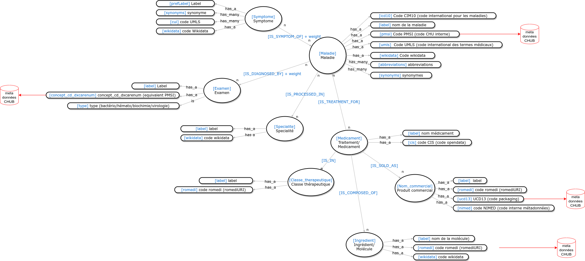

Projet MS10 - CHU Bordeaux
==========================

Ceci est la documentation du projet MS10-CHU de Bordeaux.

Pour chaque sous-dossier, se référer au README contenu dedans.

Contenu du projet
-----------------

- **data** : fichiers de données utiles dans l'un ou l'autre des sous-dossiers du projet
- **docs**: documentation automatique via sphinx (voir section suivante)
- **fhir_server**: serveur api dockerisé se branchant à la fois sur la base patient i2b2 et sur la base métadonnées Blazegraph et permettant d'interroger la base i2b2 avec réponse au format FHIR
- **ia**: algos IA faits pendant le projet
- **neo4j_data**: scripts permettant la génération des données de la base neo4j à partir de plusieurs sources, en respectant le modèle de graphe choisi
- **neo4j_db_docker**: image docker permettant la création de la base neo4j correspondant au modèle de graphe choisi avec les données créées dans neo4j_data, puis d'interroger le graphe de connaissance dans une base neo4j

Génération de la documentation
------------------------------

L'ensemble du code est documenté (dans le code ou sous forme de Readmes). Pour générer une documentation html, le moteur sphinx a été choisi

1. installer docs/requirements_doc.txt

        pip3 install -U -r docs/requirements_doc.txt
        
2. Générer la doc

        cd docs && make html
        
3. la documentation est générée dans docs/build/html. Pour l'ouvrir, ouvrir dans un navigateur, ouvrir docs/build/html/index.html

Pour personnaliser la doc, vous pouvez customiser ou changer le fichier docs/source/_static/custom.css pour un thème de https://bootswatch.com/
(vous devrez changer html_theme_options['bootswatch_theme'] avec le nom du nouveau thème dans docs/source/conf.py)

Structure du graphe neo4j
-------------------------

